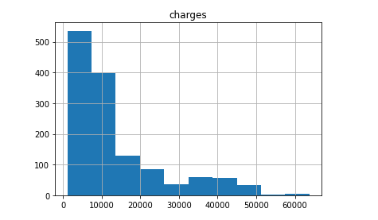
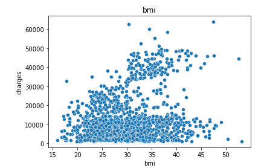

# Medical Insurance Cost Prediction using ML Regression Model

#### In this project, I used Medical Insurance Cost Dataset From Kaggle and built a Regression model to predict medical insurance cost based upon several factors 
#### E.g. BMI, Age, And more.... .


## About Dataset

People are always confused about their medical insurance and don't know the cost of insurance at different ages and conditions. This data is useful for these people and is useful to make predictions of the insurance cost they will have to pay.

#### The prediction task is to determine the cost of medical insurance.

## MetaData
The dataset has 7 features and 3630 rows.


## Project Objective

The Purpose of this project is to be able to predict the cost of medical insurance based on several features, Explore how different aspects like smoking and bmi could affect the insurance price and what type of people who pays the highest cost for medical insurance.


## Methods Used

In this project I used a variety of datascience techniques like :

- Feature Engineering

- Data Visualization

- Exploratory Data Analysis

- Hypothesis Testing

- Regression Analysis

- Predictive Modeling

- Machine Learning(Linear Regression)
## Technologies


- Python

- Jupyter Notebook

- Pandas Library

- Numpy Library

- Matplotlip Library

- Seaborn Library

- Sklearn Machine Learning Library
## Imports

```python
import pandas as pd 
import numpy as np 
import matplotlib.pyplot as plt 
import seaborn as sns 


```

## Visualizations

### Distribution of insurance charges.




### How BMI affects the charges feature


